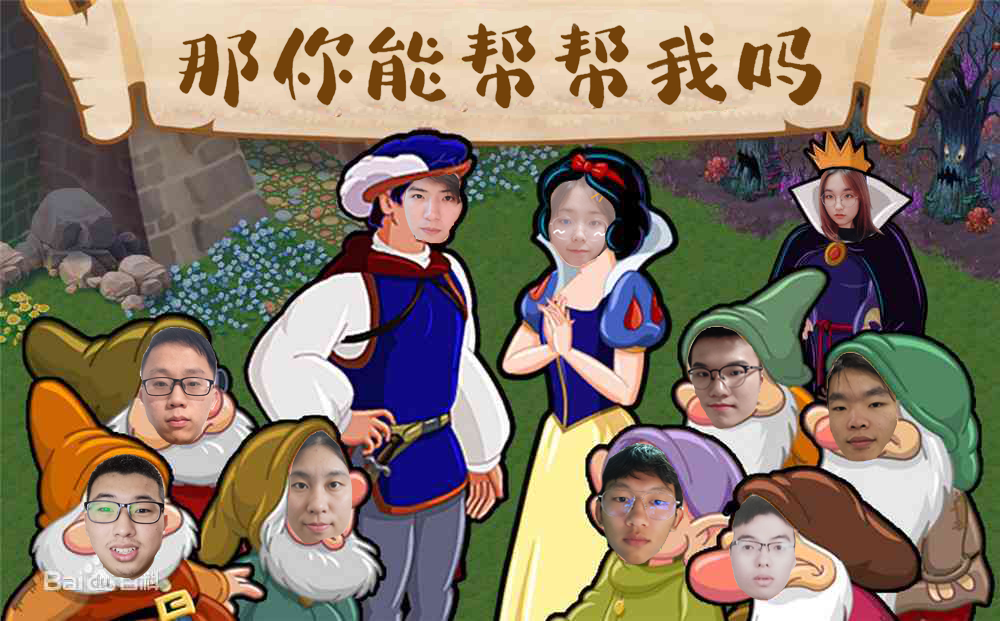
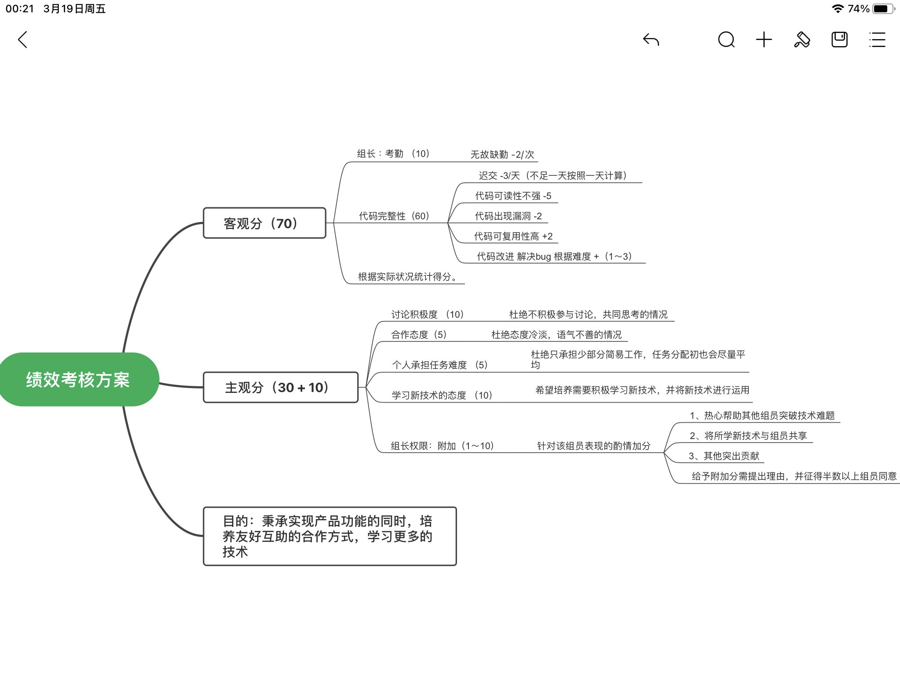

## 那你能帮帮我吗——团队展示
|这个作业属于哪个课程|[2021春软件工程实践\|W班(福州大学)](https://edu.cnblogs.com/campus/fzu/2021SpringSoftwareEngineeringPractice)|
|:-  |:-    |
|这个作业要求在哪里|[团队作业一](https://edu.cnblogs.com/campus/fzu/2021SpringSoftwareEngineeringPractice/homework/11848)|
|团队名称|那你能帮帮我吗|
|这个作业的目标|团队展示、确定项目选题|

[toc]
### 队名
>那你能帮帮我吗

### 团队项目描述
>针对二手交易、任务发布、公告宣传的福大互助平台

### 队员风采
>**学号**：221801308
>**成员姓名**：王大鱼
>**成员博客园地址**：https://www.cnblogs.com/Yuuuu/
>**成员性格**：三分钟热度的白日梦想家
>**擅长的技术**：web前端
>**兴趣爱好**：旅游、读书、听歌、刷知乎
>**希望的软工角色**：前端+组长
>**一句slogan**：吃饭不积极，脑袋有问题

----

>**学号**：221801327
>**成员姓名**：明亮
>**成员博客园地址**：https://www.cnblogs.com/huangmingliang/
>**成员性格**：善于沟通，奇葩点子多吧
>**擅长的技术**：html+css+js基础知识
>**兴趣爱好**：喜欢日常生活
>**希望的软工角色**：希望能学习前端知识
>**一句slogan**：和组员共同进步

----

>**学号**：221801301
>**成员姓名**：邵涵洋
>**成员博客园地址**：https://www.cnblogs.com/FZU-Bobby/
>**成员性格**：稳重，积极向上，风趣幽默
>**擅长的技术**：UI原型设计，ps，lr，pr
>**兴趣爱好**：摄影，长跑，看剧，做饭
>**希望的软工角色**：前端，测试，pm
>**一句slogan**：志存高远，脚踏实地

----

>**学号**：221801331
>**成员姓名**：张晨星
>**成员博客园地址**：https://www.cnblogs.com/LebronZzhang/
>**成员性格**：乐观、随和
>**擅长的技术**：java、SSM框架
>**兴趣爱好**：看别人写代码
>**希望的软工角色**：后端
>**一句slogan**：唯有代码和头发不可辜负

----

>**学号**：221801326
>**成员姓名**：王炜嘉
>**成员博客园地址**：https://www.cnblogs.com/WangWeijia0720/
>**成员性格**：外向热情
>**擅长的技术**：JAVA后端（SSM框架和Spring Boot）
>**兴趣爱好**：看电影，旅游，摄影
>**希望的软工角色**：后端
>**一句slogan**：悟已往之不谏，知来者之可追

----

>**学号**：221801124
>**成员姓名**：张思萍
>**成员博客园地址**：https://www.cnblogs.com/zsp1026/
>**成员性格**：乐观向上
>**擅长的技术**：Java
>**兴趣爱好**：养多肉
>**希望的软工角色**：后端
>**一句slogan**：努力学习，积极向上

----

>**学号**：221801304
>**成员姓名**：柠檬
>**成员博客园地址**：https://www.cnblogs.com/NingMengBlog/
>**成员性格**：谨慎
>**擅长的技术**：Java后端
>**兴趣爱好**：打篮球、打羽毛球、看动漫
>**希望的软工角色**：后端
>**一句slogan**：不敲代码就没办法生存

----

>**学号**：221801328
>**成员姓名**：pzy
>**成员博客园地址**：https://www.cnblogs.com/pzyblog/
>**成员性格**：安静，认真负责
>**擅长的技术**：安卓，web也会一些
>**兴趣爱好**：看漫画，绘画
>**希望的软工角色**：前端
>**一句slogan**：紧张是一种习惯，放松也是一种习惯。

----

>**学号**：221801420
>**成员姓名**：郑耀烽（BigClever）
>**成员博客园地址**：https://www.cnblogs.com/zhengyf/
>**成员性格**：好说话的打工仔
>**擅长的技术**：java
>**兴趣爱好**：游戏，音乐
>**希望的软工角色**：后端
>**一句slogan**：要么做第一个，要么做最好的一个

----

>**学号**：221801414
>**成员姓名**：李建雄
>**成员博客园地址**：https://www.cnblogs.com/vear-10/
>**成员性格**：摸鱼小能手
>**擅长的技术**：无较擅长，会点java
>**兴趣爱好**：看电影，羽毛球
>**希望的软工角色**：后端开发
>**一句slogan**：努力学习，不拖后腿

### 团队首次合照

### 团队绩效考核方案
>除组长评分外，其余组内互评*0.7+自评*0.3

### 团队的愿景
>该项目设计初衷主要是为了方便校内闲置物品的出售、委托及时被接受、各类活动有个专门的推广平台。
>为了实现这一目的，本次项目将设计一个平台用于提供闲置物品出售，用户发布委托、用户接受委托，活动举办方的推送。由于是校园互助平台，该项目适用范围是福大校内全体学生。
>未来希望能够把校园互助平台的功能完善，让这个平台能够真正受益于福大校内学生，生生不息。也希望团队各个成员能够在一个学期的实践中，不断提升自我，学习一些新的技术，积累项目经验。同时，在团队协作的过程中，培养沟通协作能力 ，增进团队成员之间的感情。
